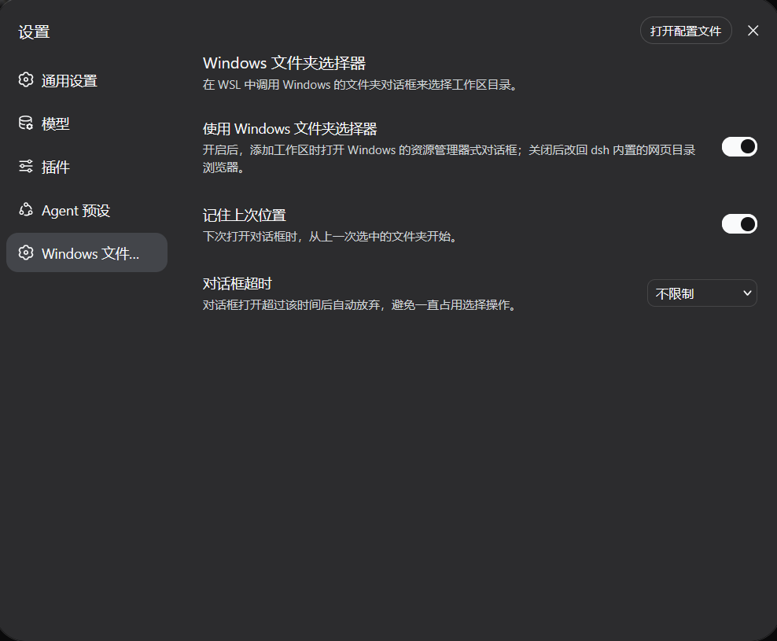

# dsh-wsl-windows-folder-picker

在 WSL 环境下使用 dsh 时，使用 Windows 的文件夹选择对话框。

装完之后，「添加工作区」打开的是 Windows 的文件夹选择对话框，设置里可以随时开关。

## 安装

要求 dsh `>=0.1.5-rc.2`。

```bash
dsh plugin --profile web add github:VoidPrim/dsh-wsl-windows-folder-picker
```

装完重启 dsh，然后刷新页面：

```bash
dsh web
```

卸载：

```bash
dsh plugin --profile web remove dsh-wsl-windows-folder-picker
```

## 设置

设置里会多一个「Windows 文件夹选择器」：



| 选项 | 默认 | 说明 |
| --- | --- | --- |
| 使用 Windows 文件夹选择器 | 开 | 关掉就回到默认 |
| 记住上次位置 | 开 | 下次直接从上次选的文件夹开始 |
| 对话框超时 | 5 分钟 | 超时自动关掉对话框，也可以设成不限制 |

## 许可

MIT
